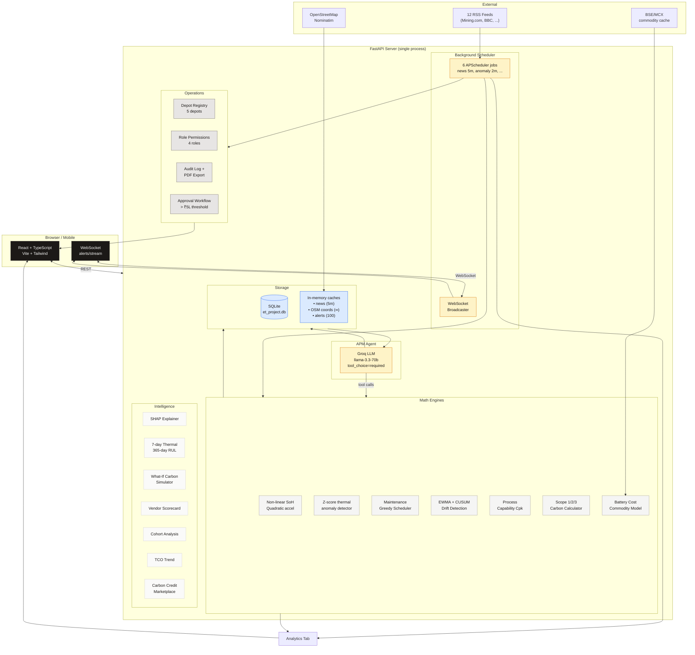
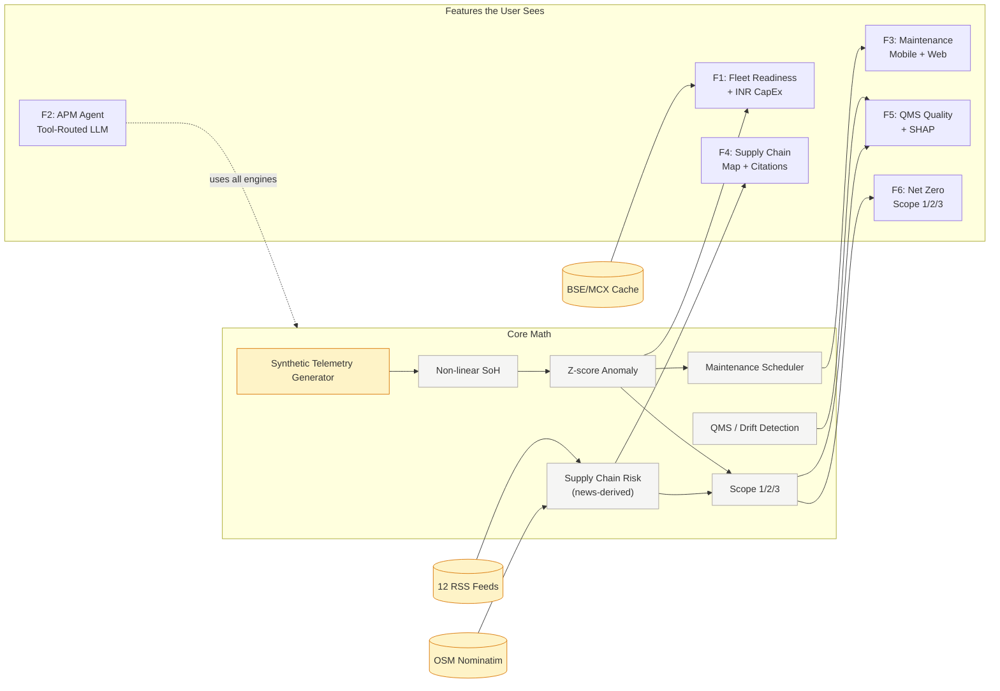
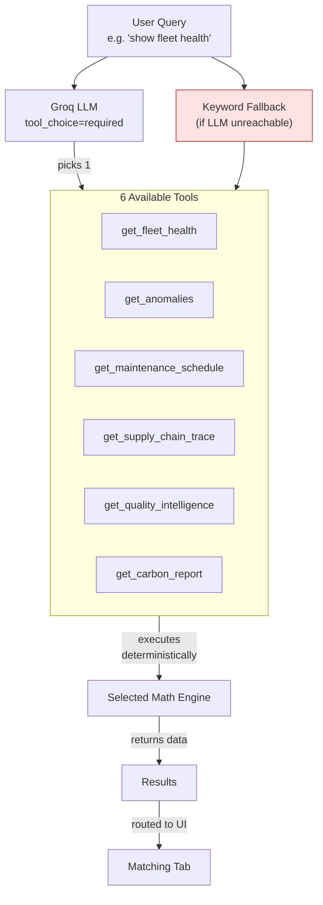
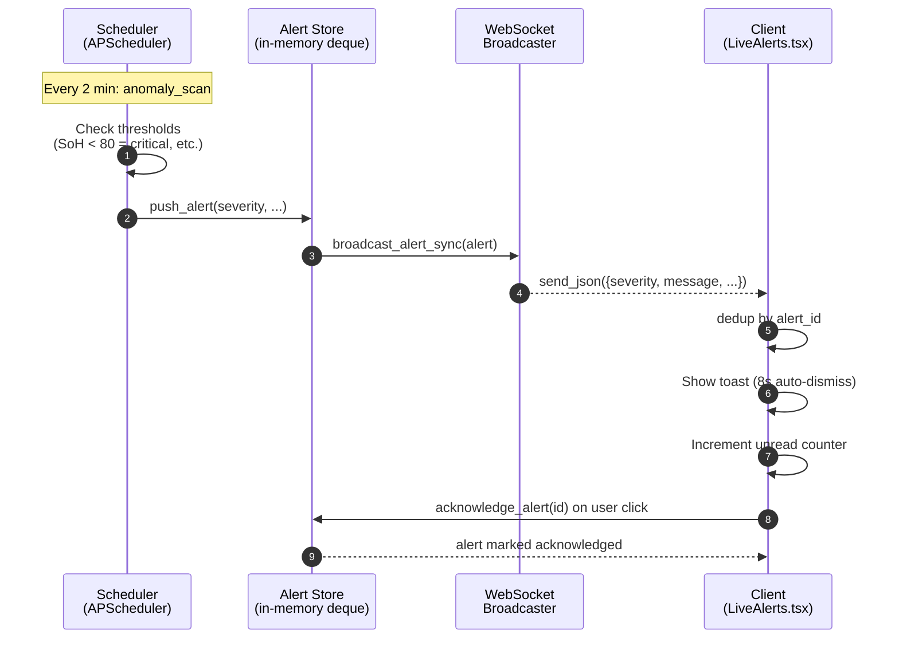
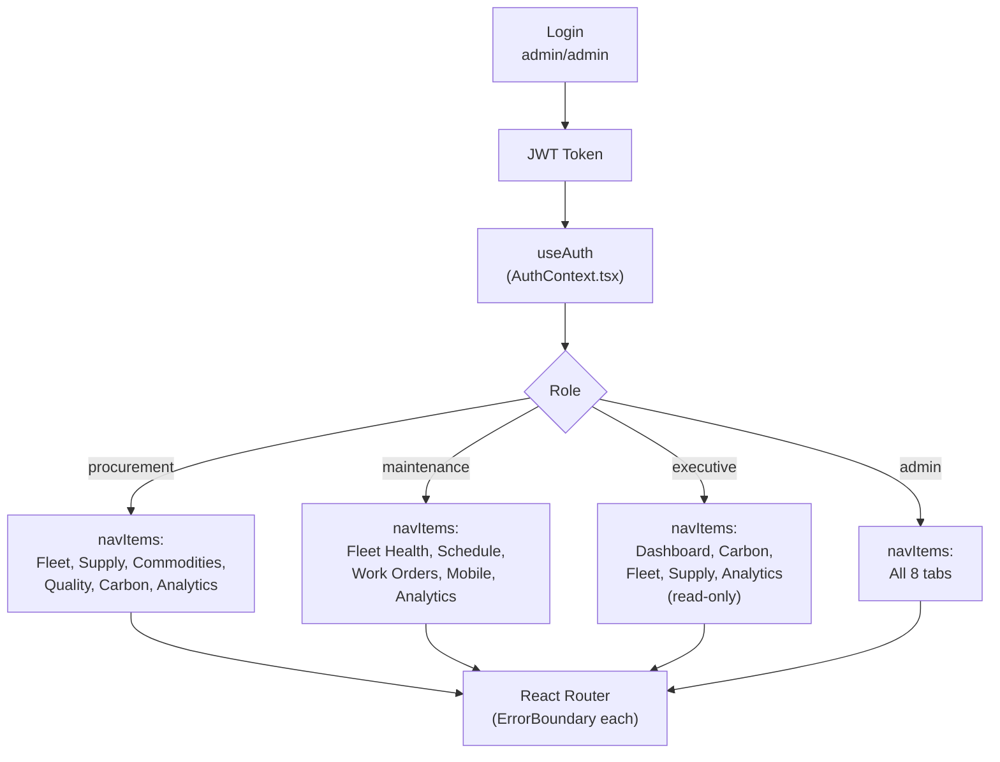
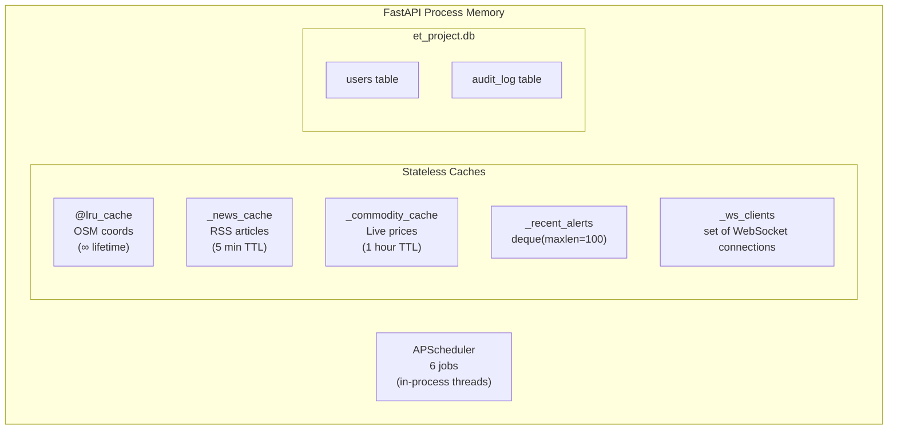

# Architecture

This document visualizes how the platform's 23 features connect through a single dependency graph. For prose documentation, see [README.md](./README.md).

## System Overview

## Data Flow: How Features Connect

**Reading this graph:** if RSS news changes, both F4 (supply chain risk) and F6 (Scope 3 carbon) update. If a battery degrades, F1 (readiness), F3 (maintenance), and F6 (Scope 1) all reflect it. **One data graph, one truth.**

## LLM Agent Tool Routing

Note: `tool_choice="required"` makes the LLM **always** pick a tool, even for vague queries like "hi" — no conversational hallucination, no empty responses.

## Live Alert Pipeline

## Multi-Role Routing

## Memory Layout

All caches are in-process — no Redis, no external broker. This is what makes the platform deployable as a single FastAPI process for hundreds of concurrent users.
